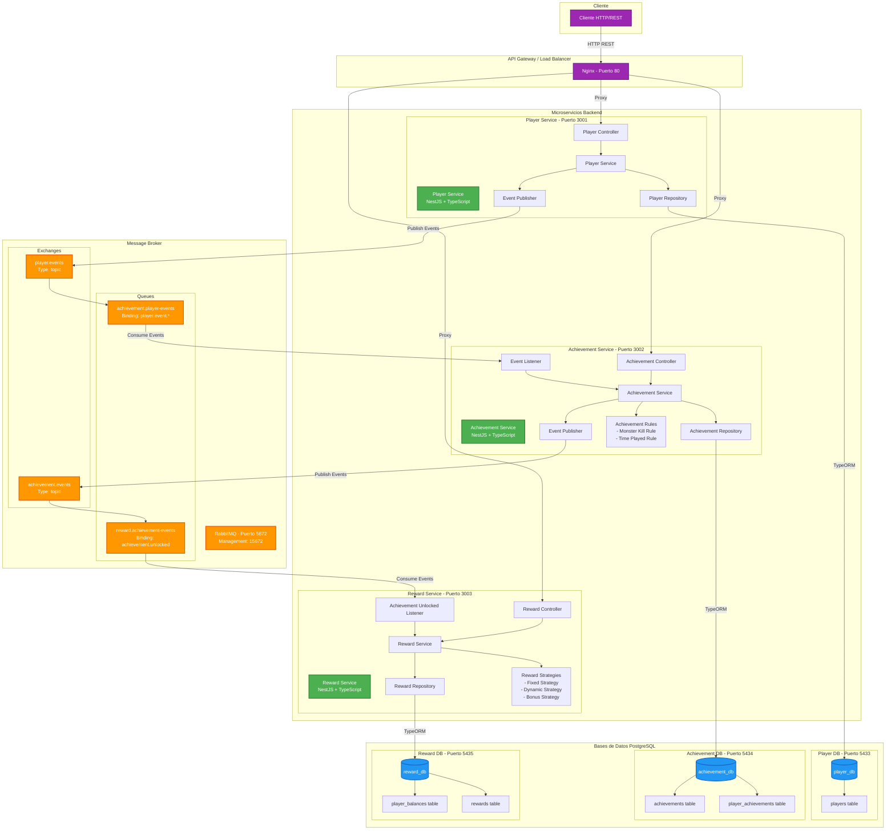

# Diagrama de Arquitectura - Sistema de Logros y Recompensas Gaming

## Arquitectura de Microservicios con Event-Driven

## Características de la Arquitectura

### 🏗️ Patrón Arquitectónico
- **Microservicios**: Cada servicio es independiente y desplegable por separado
- **Event-Driven Architecture**: Comunicación asíncrona mediante eventos
- **CQRS Parcial**: Separación de comandos (escritura) y consultas (lectura)

### 🔄 Comunicación
- **Síncrona**: REST API para operaciones CRUD directas
- **Asíncrona**: RabbitMQ para eventos entre servicios
- **Protocolo**: HTTP/REST + AMQP

### 📦 Tecnologías
- **Framework**: NestJS (Node.js + TypeScript)
- **ORM**: TypeORM
- **Message Broker**: RabbitMQ
- **Base de Datos**: PostgreSQL (3 instancias independientes)
- **Contenedores**: Docker + Docker Compose

### 🎯 Principios SOLID Aplicados
- **Single Responsibility**: Cada servicio tiene una responsabilidad única
- **Open/Closed**: Extensible mediante nuevas reglas y estrategias
- **Liskov Substitution**: Interfaces y abstracciones consistentes
- **Interface Segregation**: Contratos específicos por dominio
- **Dependency Inversion**: Inyección de dependencias en todos los niveles

### 🔐 Resiliencia
- **Retry Logic**: Reintentos automáticos en caso de fallo
- **Message Acknowledgment**: ACK/NACK para garantizar procesamiento
- **Dead Letter Queues**: Mensajes fallidos se pueden reencolar
- **Health Checks**: Endpoints de salud en cada servicio

### 📊 Métricas y Observabilidad
- **Logging**: Console logs estructurados en cada servicio
- **RabbitMQ Management**: Dashboard web para monitoreo de colas
- **Database Monitoring**: PostgreSQL logs y métricas

## Puertos y Endpoints

| Servicio | Puerto | Endpoints Principales |
|----------|--------|----------------------|
| Player Service | 3001 | `/players`, `/players/:id` |
| Achievement Service | 3002 | `/achievements`, `/player-achievements/:playerId` |
| Reward Service | 3003 | `/rewards`, `/balance/:playerId` |
| RabbitMQ | 5672 | AMQP Protocol |
| RabbitMQ Management | 15672 | Web UI |
| Player DB | 5433 | PostgreSQL |
| Achievement DB | 5434 | PostgreSQL |
| Reward DB | 5435 | PostgreSQL |

## Escalabilidad

### Horizontal Scaling
- ✅ Cada servicio puede escalarse independientemente
- ✅ RabbitMQ soporta múltiples consumidores por cola
- ✅ PostgreSQL puede configurarse con replicas de lectura

### Vertical Scaling
- ✅ Ajuste de recursos por servicio en Docker Compose
- ✅ Configuración de memoria y CPU por contenedor
- ✅ Optimización de queries y conexiones a BD

## Seguridad

### Nivel de Red
- 🔒 Servicios en red interna de Docker
- 🔒 Solo puertos necesarios expuestos al host
- 🔒 RabbitMQ con autenticación por defecto

### Nivel de Aplicación
- 🔒 Validación de DTOs con class-validator
- 🔒 Sanitización de inputs
- 🔒 Error handling consistente

### Nivel de Datos
- 🔒 Conexiones a BD con credenciales
- 🔒 Transacciones ACID en PostgreSQL
- 🔒 TypeORM para prevenir SQL injection
