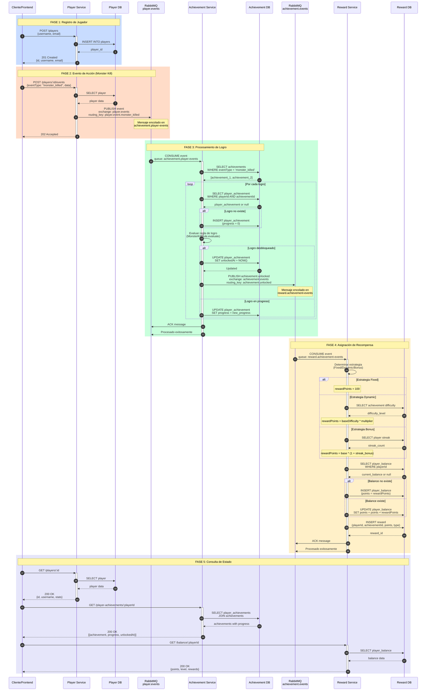

# Diagrama de Flujo End-to-End - Sistema de Logros y Recompensas

## Flujo Completo: Desde Acción del Jugador hasta Recompensa



## Descripción del Flujo

### 🎮 FASE 1: Registro de Jugador
1. Cliente envía datos del jugador (username, email)
2. Player Service valida y persiste en Player DB
3. Retorna ID del jugador creado

**Endpoints:**
- `POST /players`

**Estado:** Jugador registrado en el sistema

---

### 🎯 FASE 2: Evento de Acción del Jugador
4. Cliente registra una acción (ej: monster_killed)
5. Player Service valida el jugador existe
6. **Publica evento a RabbitMQ** en exchange `player.events`
7. Evento encolado en `achievement.player-events`
8. Retorna 202 Accepted (procesamiento asíncrono)

**Eventos Soportados:**
- `player.event.monster_killed`
- `player.event.time_played`
- `player.event.level_up`
- etc.

**Estado:** Evento publicado, esperando procesamiento

---

### 🏆 FASE 3: Procesamiento de Logro
9. Achievement Service **consume evento** de la cola
10. Busca logros relacionados con el tipo de evento
11. Para cada logro:
    - Verifica si existe player_achievement (crea si no existe)
    - Evalúa la regla del logro (MonsterKillRule, TimePlayedRule, etc.)
    - Si se cumple la condición:
      - Actualiza `unlockedAt` en player_achievement
      - **Publica evento `achievement.unlocked`** a RabbitMQ
    - Si no se cumple:
      - Actualiza progreso del logro
12. Confirma procesamiento (ACK)

**Reglas de Negocio:**
- Cada regla tiene su propia lógica de evaluación
- No se re-procesa un logro ya desbloqueado
- Progreso se acumula si el logro no está completo

**Estado:** Logro evaluado, evento de desbloqueo publicado si aplica

---

### 💰 FASE 4: Asignación de Recompensa
13. Reward Service **consume evento achievement.unlocked**
14. Determina estrategia de recompensa:
    - **Fixed**: Puntos fijos por logro
    - **Dynamic**: Basado en dificultad del logro
    - **Bonus**: Multiplica por racha del jugador
15. Calcula puntos según estrategia
16. Actualiza/crea balance del jugador
17. Registra la recompensa en tabla rewards
18. Confirma procesamiento (ACK)

**Estrategias:**
```typescript
Fixed: 100 puntos
Dynamic: baseDifficulty * multiplier
Bonus: base * (1 + streak_bonus)
```

**Estado:** Recompensa asignada, balance actualizado

---

### 📊 FASE 5: Consulta de Estado
19-24. Cliente puede consultar:
    - Datos del jugador (Player Service)
    - Logros y progreso (Achievement Service)
    - Balance y recompensas (Reward Service)

**Endpoints de Consulta:**
- `GET /players/:id` - Info del jugador
- `GET /player-achievements/:playerId` - Logros desbloqueados y en progreso
- `GET /balance/:playerId` - Puntos y recompensas

**Estado:** Cliente tiene vista completa del progreso

---

## Características del Flujo

### ⚡ Procesamiento Asíncrono
- Las fases 3 y 4 son completamente asíncronas
- No bloquea al cliente esperando procesamiento
- Permite alta concurrencia

### 🔄 Garantías de Entrega
- **At-Least-Once Delivery**: Mensajes se reencolan si falla el procesamiento
- **ACK/NACK**: Confirmación explícita de procesamiento
- **Idempotencia**: Servicios verifican estado antes de procesar

### 🛡️ Manejo de Errores
```typescript
// Si falla procesamiento en Achievement Service:
try {
  await processEvent(event);
  channel.ack(msg); // ✅ Éxito
} catch (error) {
  channel.nack(msg, false, true); // ❌ Reencolar
}
```

### 📈 Latencias Esperadas
| Fase | Tipo | Latencia Estimada |
|------|------|-------------------|
| 1 | Síncrono | ~50-100ms |
| 2 | Síncrono + Async | ~100-200ms (response), +processing async |
| 3 | Asíncrono | ~200-500ms |
| 4 | Asíncrono | ~100-300ms |
| 5 | Síncrono | ~50-150ms |

**Total E2E (con procesamiento completo):** ~1-2 segundos

---

## Casos de Uso Ejemplo

### Caso 1: Primer Monster Kill
```
1. POST /players/123/events {eventType: "monster_killed", data: {monsterId: "orc-1"}}
2. Event published: player.event.monster_killed
3. Achievement Service evalúa: "FIRST_BLOOD" ✅ UNLOCKED
4. Event published: achievement.unlocked
5. Reward Service: +100 points (Fixed Strategy)
6. GET /balance/123 → {points: 100}
```

### Caso 2: Monster Kill #5 (Progreso)
```
1. POST /players/123/events {eventType: "monster_killed", data: {monsterId: "goblin-5"}}
2. Event published: player.event.monster_killed
3. Achievement Service evalúa: "MONSTER_SLAYER" (requires 10 kills)
   - Current progress: 4 → 5
   - Status: IN_PROGRESS ⏳
4. No event published (logro no completado)
5. No recompensa asignada
6. GET /player-achievements/123 → [{code: "MONSTER_SLAYER", progress: 50%}]
```

### Caso 3: Tiempo Jugado (Acumulativo)
```
1. POST /players/123/events {eventType: "time_played", data: {minutes: 30}}
2. Event published: player.event.time_played
3. Achievement Service evalúa: "DEDICATED_GAMER" (requires 60 min)
   - Accumulated time: 45 → 75 minutes
   - Status: UNLOCKED ✅
4. Event published: achievement.unlocked
5. Reward Service: +200 points (Dynamic Strategy, difficulty: 2)
6. GET /balance/123 → {points: 300}
```

---

## Testing E2E

### Escenarios Cubiertos (25/28 passing)
✅ **Complete Flow (4/4)**
- Flujo completo de jugador → evento → logro → recompensa
- Múltiples logros en un evento
- Progreso acumulativo

✅ **Contract Tests (10/10)**
- Validación de schemas de eventos
- Estructura de mensajes RabbitMQ
- DTOs entre servicios

🟡 **Resilience Tests (11/13)**
- Reintentos automáticos
- Manejo de servicios caídos
- Edge cases de race conditions

---

## Monitoreo y Logs

### Logs Estructurados
```
Player Service: 📤 Publishing event: player.event.monster_killed
RabbitMQ: 📨 Message enqueued: achievement.player-events
Achievement Service: 📥 Received player event
Achievement Service: 🏆 Achievement unlocked: FIRST_BLOOD
RabbitMQ: 📨 Message enqueued: reward.achievement-events
Reward Service: 📥 Received achievement.unlocked event
Reward Service: 💰 Reward assigned: 100 points
```

### Métricas Clave
- Eventos publicados por segundo
- Tiempo promedio de procesamiento por fase
- Tasa de errores y reintentos
- Cola depth (profundidad de mensajes pendientes)
